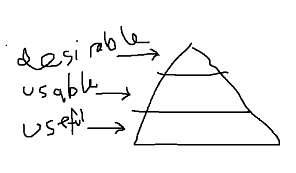

# General stuff
The tool has to be useful > usable > desirable

Fast iteration process = better results
```mermaid
graph LR;
    Evaluation-->Analysis;
    Analysis-->Design;
    Design-->Evaluation;
```

# Tool value
* How many people use the tool?
* How much time does it save them?
* Goals: what is the problem we're trying to solve?
### ROI
* Production time
* Number of users
* Usage frequency (per feature)
* Users time per month vs TechArt time
* Future benefits

# Cognitive load
* Cognitive [HIGH]
* Visual [MED]
* Motor [LOW]
* RTFM = bad

# Users
* Personas / scenarios
* Who is using the tool? (grafana?)
* Beginner / intermediate / expert - which levels are useful for the tool?
* Shared vision who we're designing for
* users -> chart out technical skills / frequency
* in what context is the tool used?

# Goals
* What is the problem we're trying to solve?
* Programmer vs user mental model
* Stakeholder vs user goals
* Balance between groups (artists <> coders <> mgmt)
* features vs goals -> ask for user goals, not features

# Design process
* Prototype with alternatives
* Visualize == communicate more clearly
* Frequent iterations
* Start with users
* metrics + focus groups + watch people work
* watch people work -> ask about workarounds

# Task flows
Create task flow graph + branch off by % of users
```mermaid
graph LR;
    Action-->PercentUsersA;
    Action-->PercentUsersB;
    PercentUsersA-->AnotherAction1;
		PercentUsersB-->AnotherAction2;
```
Note down:
* Problematic actions
* Optimal version

# User Object
* Example:
	* Object: Point light
	* Attributes: Color (rgb), Intensity(%)
	* Actions: Move, Set color

* Color (rgb / hsv / hex ) <- examples
* find the most common attributes of user objects + value range

# Measuring progress
* Efficiency
* Learnability
	* Observe a (new) user
* Would the tool make sense with no documentation?

# Creating personas
* Find common goals & mental models - group related ones
* Alternatively, use existing personas (modeler, designer, etc)
* Create realistic personas (with a name, image, etc)

# Scenario storyboards
* Keep at *high level* - do not influence assumptions
* interactions with *user objects*
* W/ simple drawing
#### Example:
```mermaid
graph LR;
    UsersGoal-->ActionUserObject;
    ActionUserObject-->Action;
    Action-->AnotherAction;
		AnotherAction-->Goal;
```
