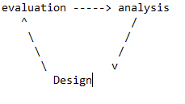

# User testing
## Create a test plan
* List of tasks for user to do
* Look for ideas from user / stakeholder goals, task flows, storyboard
## How to phrase tasks
* How would you do this? (not: now do that)
## Don't assign leading tasks
* Tell the goal, not how to
## Realism + context
## Specific tasks are easier to measure
* Easier comparison, also in the future
## Selecting users
* User who fits profile & who already uses the tool
* It's better to test with "similar" users sooner than "perfect" users later
## How many users
* Max 5 per profile
* * *
## In the test situation
* Resist the urge to help
	* Understand why the user is having issues
*  Consider a dedicated note taker
* Keep under an hour
* Record the session

* * * 
## After the test
### Compare measurements
* Statistics
* Expert user
* Analysis

